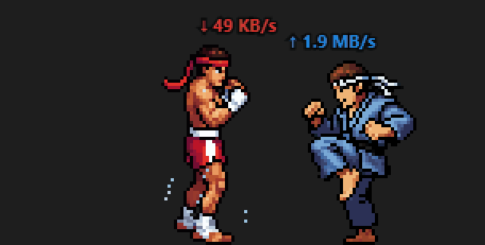

<div align="center">



<h1>NetBattle</h1>

<div align="center">
  
  
  
  
</div>

</div>

<br>

<p align="center">
  <b>Your network traffic, as a martial arts fight on top of your taskbar.</b><br>
  <sub>Red is download. Blue is upload. Whoever moves more data wins the exchanges.</sub>
</p>

<p align="center">
  <a href="#download"><b>Download</b></a> &nbsp;·&nbsp;
  <a href="#what-you-see">What you see</a> &nbsp;·&nbsp;
  <a href="#what-you-can-do">What you can do</a> &nbsp;·&nbsp;
  <a href="#for-developers">For developers</a>
</p>

NetBattle is a small desktop buddy. Two pixel-art fighters stand on your taskbar: a Muay Thai fighter in red shorts for your download speed, and a karateka in a blue gi for your upload speed. Each one fights as hard as its own traffic lets it. Start a big download and red takes over the fight; upload a video and blue does. It reads only your network adapters' byte counters and sends nothing anywhere.


<a name="download"></a>

##  Download

There is no packaged release yet. For now, build it from source (see [For developers](#for-developers)).

| Platform | Status |
|---|---|
|  &nbsp;**Windows** | Works. Fighters stand on top of the taskbar. |
|  &nbsp;**macOS** | Planned. Fighters will stand on the Dock. The build has to run on a Mac. |


<a name="what-you-see"></a>

##  What you see

###  Traffic drives the fight

- **Each fighter runs on its own traffic:** red on download, blue on upload.
- **More traffic means** more frequent attacks, harder hits, longer combos and better defence.
- **Moves always play at human speed.** Traffic changes what a fighter does, never how fast it moves.
- **Outclassed sides struggle.** At megabytes against kilobytes, the weaker fighter barely attacks, and when it does, the stronger one dodges in slow motion or counters.
- **The leader chases.** When the fighters drift apart, the faster side closes in and the slower side catches its breath.

###  Real techniques

- **Red, Muay Thai:** jab, straight, hook, knee, low, mid and high kick, and the teep.
- **Blue, karate:** gyaku-zuki, shuto, mae-geri, yoko-geri, knee, and low, mid and high kicks.
- **Defence:** blocks, shin checks, sways and ducks, picked to suit the strike coming in.
- **Knockdowns:** a fighter that takes too much goes down and gets back up.
- **Footwork:** fighters step in and out to the distance where their strike lands, and strike only when it can reach.
- **Impacts you can feel:** a landed hit freezes the frame for a moment, shoves the defender back and throws a starburst of sparks. Light hits splash sweat; strong hits splash blood. Kicks and knees hit harder than punches.
- **Bullet time** with afterimages on big kicks and slow-motion dodges.


<a name="what-you-can-do"></a>

##  What you can do

###  Play with them

- **Hover** over a fighter to slow the fight down.
- **Keep hovering for 2 seconds** to open its info panel: live traffic, who leads, and this session's strikes thrown, landed and blocked. Level and stats (agility, stamina, strength) are placeholders for now.
- **Drag** either fighter anywhere on screen. Let go and it falls back onto the taskbar.
- **Clicks pass through** everywhere except the fighters, so they never get in the way of your work.
- **Quit** from the tray icon.


<a name="for-developers"></a>

##  For developers

You need [Node.js](https://nodejs.org) and [Rust](https://rustup.rs).

```sh
npm install
npm run dev     # run with hot reload
npm run build   # Windows installers in src-tauri/target/release/bundle/
```

<details>
<summary><b>Test modes</b></summary>

<br>

Set `NETBATTLE_SHOWCASE` before starting the app:

| Value | What it does |
|---|---|
| `1` | Plays every move of both fighters in a fixed order, on a solid backdrop, so each animation can be recorded and checked. |
| `fight` | Runs the real fight AI with fake traffic that switches every 15 seconds: red leads, blue leads, then a close race. Logs every strike's distance against its contact distance. |

The scripts in `tools/` check recordings and clips:

| Script | What it checks |
|---|---|
| `analyze_showcase.py` | Floating and position pops in a recording |
| `zoom_sheet.py` | Contact sheet of a recording, cropped around the fighters |
| `make_gif.py` | Cuts a window of a recording into the README GIF |
| `overlap_check.py` | Frames where the two bodies overlap |
| `motion_check.py` | Each fighter's body position per frame: jumps, jitter, standing still |
| `foot_track.py` | Whether a clip's planted foot stays still |
| `audit_clips.py` | Airborne and duplicate frames in the sprite clips |

</details>

<details>
<summary><b>Built with</b></summary>

<br>

NetBattle is a **[Tauri 2](https://tauri.app)** app. The Rust side samples network speeds with **[sysinfo](https://github.com/GuillaumeGomez/sysinfo)**, sizes a transparent always-on-top window to the work area above the taskbar, switches click-through on and off, and runs the tray icon. The fight is plain JavaScript on a `<canvas>`, with no framework and no build step: fight AI, footwork, hit detection and sprite playback, which pins the planted foot so fighters never slide.

| File | What lives there |
|---|---|
| `src-tauri/src/main.rs` | Network sampling, window sizing, click-through, tray |
| `src/main.js` | Moves, fight logic, footwork, dragging, drawing; tuning constants at the top |
| `src/sprites/` | The fighter animation clips and `manifest.json` |

</details>


##  License

No license has been chosen yet.
